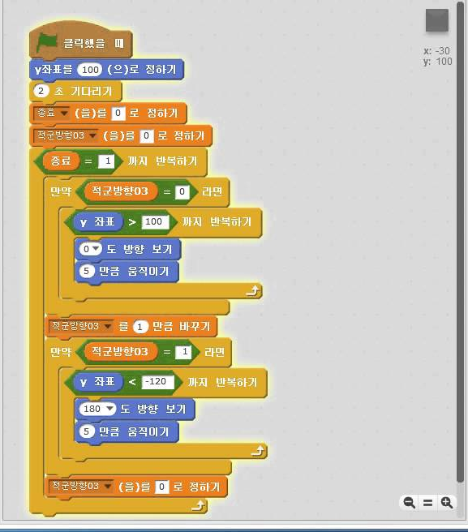

# **국군행사도우미(Event Scheduler)**

## **주제**
### '각 부대마다 서로 다른 식순들을 모듈화 하여 진행가능한 어플리케이션'

## **개요**

> - 각 부대마다 서로다른 식순 및 의전곡 들을 모듈화 하여 사용자가 직접 식순을 커스터마이징이 가능하며,
각 식순에 맞는 대사와 행동을 사용자가 입력하여 실제 행사시 실시간으로 진행 절차를 볼수 있는 서비스를 제공합니다.

## **개발 배경**

> - 군부대 행사에 참여하다 보면 행사마다 꼭 들어가는 식순이 있고 또 부대 마다 독자적으로 있는 식순이 있습니다. 이렇다 보니
행사 진행간 식순 순서나 행사 내용등의 파편화가 심하여 행사 주관자에 따라서 유동성이 심합니다. 

> - 행시 진행시 간략한 진행 테이블은 나와있지만 자세하게 각 식순간 해당되는 사람이 해야할 행동, 대사 등은 나와있지 않다보니
우왕좌왕 하게 되어 행사의 흐름을 망칩니다.

> - 그렇지 않기 위해서는 많은 시간을 들여 연습을 해야함으로 행사 주최측의 인원 통제에 대한 부담이 심합니다.

> - 이에 따라서 각 부대별로 각기 다른 식순을 모듈화하여 손쉽게 삽입이 가능하며 행사 전체에 대한 흐름을 한눈에 확인할 수 있는
어플리케이션을 개발하게 되었습니다.

## **개발 기능**

> - 행사시 행사 진행에 따른 절차를 실시간으로 대본 처럼 볼 수 있음

> - 행사 식순을 모듈화 할수 있음

> - 모듈화 된 식순을 메인 뷰에서 손쉽게 추가 가능함 

> - 그룹을 만들어 그룹에 내가 만든 행사를 공유할 수 있으며 실시간으로 편집 가능함

> - 행사 진행간 무전기능 지원

> - 

## **기능 설명**

> - 본 서비스는 대통령이나 가수가 행사나 공연시 사용하는 프롬프터와 코딩 교육 프로그램인 Scratch 에서 착안하여 개발하였습니다.

 
 
프롬프터는 강단에 선 사람이 할 말을 띄워주는 일종의 모니터로 대본을 표시해줍니다.
Scratch 는 블록형 코딩 프로그램으로 마우스로 여러 블록들을 조합하는 방식으로 프로그래밍을 진행합니다.
이런 두가지의 특성에서 착안하여 행사 진행시 진행자가 직접 스마트폰을 보면서 행사를 진행하며, 
행사를 기획할때에는 미리 만들어 둔 행사 조각을 행사 진행 테이블에 쉽게 삽입할 수 있습니다.

> - 행사 진행 테이블에는 음악이나 멀티미디어 자료들을 탑재할 수 있어 애국가나 부대별 음악 필요시 별도의 요원 없이 진행자가 직접 재생할 수 있습니다.

> - 또한 이렇게 만든 행사를 그룹을 만들어서 해당 그룹에 공유가 가능하며 그룹간에는 실시간으로 편집이 가능하며 무전 기능도 제공합니다.

> - 그룹 가입은 초기 앱 실행시 입력한 군번과 이름을 통해서 그룹 생성자가 군번과 이름을 조회해 초대 가능합니다.

## **사용 방법**

> - 메인화면에는 3개의 메뉴가 있습니다

> - EDIT EVENT

> - EDIT TEMPLTE

> - EDIT GROUP

> - EDIT EVENT 행사일정을 관리하고 행사 테이블을 관리하는 메뉴
들어가게 되면 달력이 나오며 날짜를 선택하고 Action Bar 에서 +버튼을 선택하면 일정을 추가할수 있습니다.
일정을 추가하면 달력 밑에 일정 목록이 나오게 되며 일정 목록을 선택하면 행사 전체 테이블을 관리할 수 있으며
EDIT TEMPLTE 에서 추가한 식순 블럭들을 추가할 수 있으며 그룹을 통한 공유도 가능합니다.

> - EDIT TEMPLTE - 행사 식순 조각들을 추가하고 편집할수 있는 메뉴
들어가게 되면 화면을 반으로 나누어 왼쪽에는 추가된 블럭들이 list 로 나오며 오른편에서는 왼쪽에서 선택된 블럭을 수정하거나
새롭게 추가할 수 있습니다. Action Bar 에서 저장 버튼을 누르면 블럭을 추가하게 되며 휴지통 버튼을 누르면 블럭을 삭제 할 수 있습니다.

> - EDIT GROUP - 그룹을 관리하는 메뉴
들어가서는 그룹을 생성하고 그룹의 멤버를 초대할 수 있습니다.
